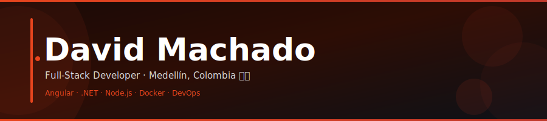

<!-- Banner SVG propio — hosteado en el mismo repo, tipografía real embedida -->


<br/>

<!-- Typing SVG dinámico — funciona en GitHub como imagen externa -->
<div align="center">
  
</div>

<br/>

<!-- Badges de redes -->
<div align="center">

[](https://github.com/D-MachadoDev)
[](https://linkedin.com/)
[](mailto:avidmachado@gmail.com)
[](https://hits.sh)

</div>

---

## `// sobre mí`

```typescript
const david = {
  ubicación:    "Medellín, Colombia 🇨🇴",
  rol:          "Full-Stack Developer",
  actualmente:  ["proyectos full-stack personales", "Docker", "DevOps", "CI/CD"],
  pregúntame:   ["Angular", "MEAN/MERN", ".NET", "Python"],
  contacto:     "avidmachado@gmail.com",
  dato_curioso: "Gran sentido del humor + obsesión por mejorar continuamente 🚀",
};
```

---

## `// stack tecnológico`

**Frontend**


**Backend**


**Bases de datos & DevOps**


**Herramientas**


---

## `// estadísticas`

<div align="center">
  
  
</div>

<br/>

<div align="center">
  
</div>

<br/>

<div align="center">
  
</div>

---

## `// proyectos`

| Proyecto | Descripción | Stack |
|----------|-------------|-------|
| [**PetPaws**](https://github.com/D-MachadoDev/PetPaws) | Conecta amantes de mascotas con veterinarios, paseadores y refugios. Geolocalización + reserva online. | `Angular` `Node.js` `MongoDB` |
| 🚧 **Próximamente** | Proyectos en desarrollo — ¡muy pronto! | — |

---

## `// snake animation`

<!-- La imagen se genera con el workflow .github/workflows/snake.yml -->
<picture>
  <source media="(prefers-color-scheme: dark)"  srcset="https://raw.githubusercontent.com/D-MachadoDev/D-MachadoDev/output/github-snake-dark.svg"/>
  <source media="(prefers-color-scheme: light)" srcset="https://raw.githubusercontent.com/D-MachadoDev/D-MachadoDev/output/github-snake.svg"/>
  
</picture>

---

## `// objetivos 2026`

- ⬢ Dominar Docker y pipelines CI/CD en producción
- ⬢ Lanzar mi primera aplicación web propia
- ⬢ Contribuir activamente a proyectos open-source
- ⬢ Crear y comercializar mi primer producto digital
- ⬢ Compartir conocimiento con la comunidad de devs
- ⬢ Crecer hacia un rol full-stack senior

---

## `// filosofía`

> *"El único límite es el que tú mismo te pongas."*

<br/>

<div align="center">
  <sub>Gracias por visitar · ¡Conectemos y construyamos algo increíble juntos!</sub>
</div>
